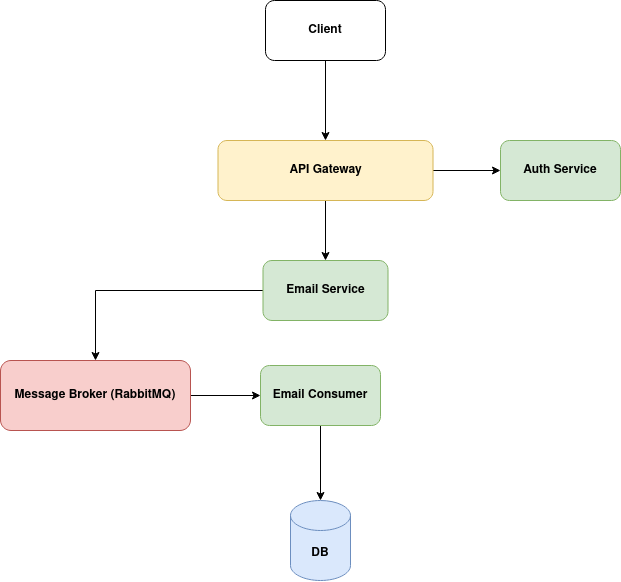

# Email Service with RabbitMQ and Docker

A simple email service with message broker using RabbitMQ and running inside docker container.

This simple application comprised of: 

- Written using PHP,
- An authentication using JWT,
- PostgreSQL for store all sent message/email and users,
- RabbitMQ as message broker,
- Docker

## Getting Started

Assume you already have Docker installed. See https://docs.docker.com/installation/.

First, clone the this project and build locally:

`docker-compose build`

Then you can run as an application using:

`docker-compose up`

Once it has started, you can open your browser to http://localhost:8888

## API Endpoints

### Register


```http
POST /register
```

You can do a POST to `/register` to register a new user.

| Body       | Type     | Description  |
| :--------- | :------- | :----------- |
| `name`     | `string` | **Required** |
| `username` | `string` | **Required** |
| `password` | `string` | **Required** |

It returns the following:

```json
{
    "success": true,
    "message": "User has been created!"
}
```

### Login

```http
POST /login
```

You can do a POST to `/login` to authenticate a user.

| Body       | Type     | Description  |
| :--------- | :------- | :----------- |
| `username` | `string` | **Required** |
| `password` | `string` | **Required** |

It returns the following:

```json
{
    "success": true,
    "token": "your-token"
}
```

### Send Email

```http
POST /send-email
```

You can do a POST to `/send-email` to send an email. It require **authentication**.

The JWT - token must be sent on the Authorization header as follows: `Authorization: Bearer {your-token}`

| Body           | Type     | Description  |
| :------------- | :------- | :----------- |
| `email`        | `string` | **Required** |
| `emailSubject` | `string` | **Required** |
| `emailBody`    | `text`   | **Required** |

It returns the following:

```json
{
    "success": true,
    "message": "Email has been sent!"
}
```

## Architecture Design



* API Gateway which auth a request from client
* Email Service which send a message to Message Broker
* Email Consumer which consumes messages and store them in DB
   